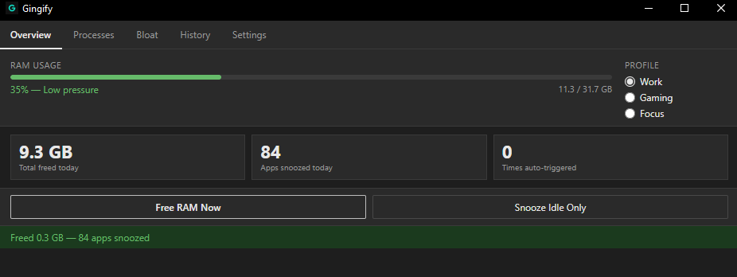
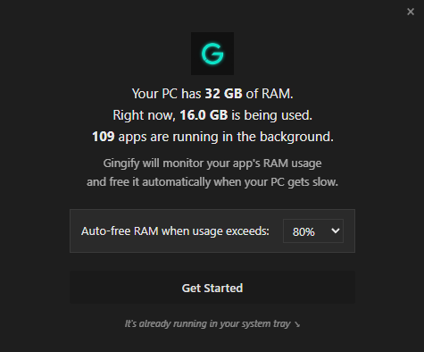
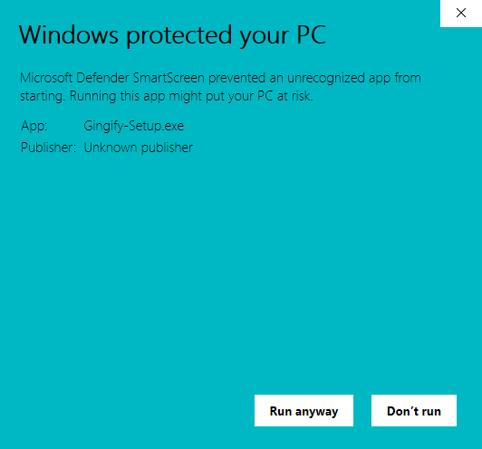
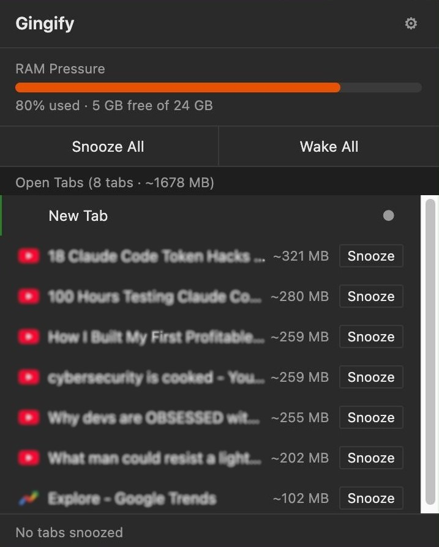
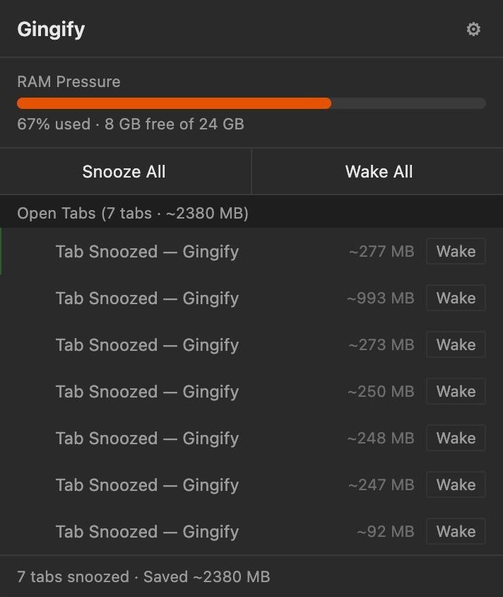
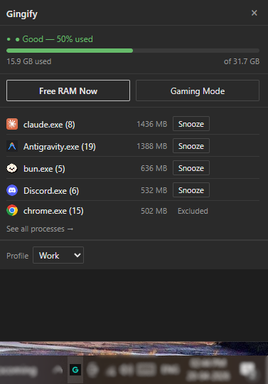
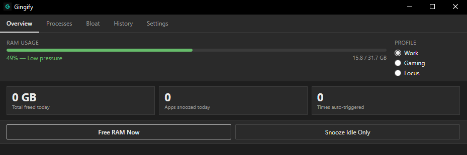
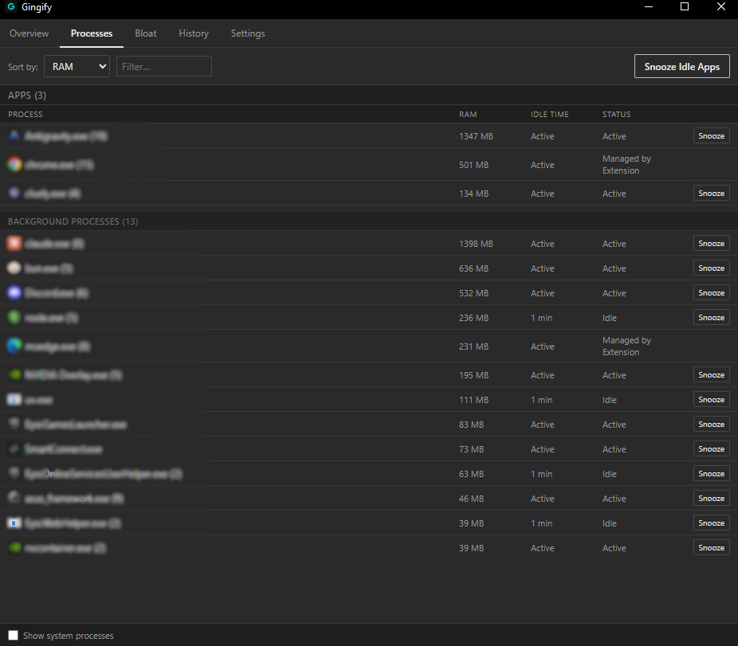
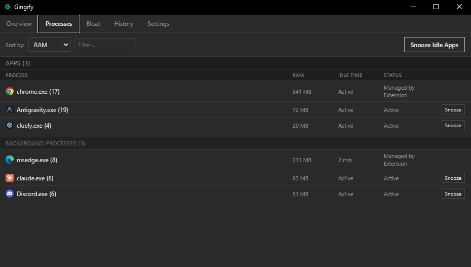
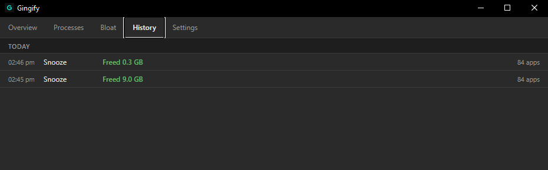

# Gingify — RAM Manager for Windows

[](https://github.com/IshekKhal/gingify/actions/workflows/build.yml)
[](https://github.com/IshekKhal/gingify/releases)


> Free up RAM instantly, without rebooting — so your games, apps, and browser tabs run faster.

---

## What is Gingify?

Gingify sits quietly in your Windows system tray and watches your RAM. When background apps are wasting memory they are not actively using, Gingify puts them to sleep — freeing up RAM for whatever you are actually doing.

- **Nothing is killed.** Snoozed apps are still running. They wake up the instant you click on them, exactly where you left off.
- **Nothing is hidden.** Every action Gingify takes is logged in the History tab so you always know what happened.
- **No subscription, no telemetry, no bloatware.** It is a single ~2.5 MB installer.

**Requirements:** Windows 10 or Windows 11 (64-bit).

One click, and the payoff is visible immediately — 84 background apps snoozed, 9.3 GB of RAM back, without closing anything:



---

## Why does Gingify ask for administrator access?

When you launch Gingify, Windows will show a "Do you want to allow this app to make changes to your device?" prompt. **This is expected — click Yes.**

Gingify needs administrator rights to:

- **Snooze any app**, including apps that also run as administrator (such as games, anti-cheat software, or other system tools). Without admin rights, Gingify can only touch non-admin processes.
- **Use Gaming Mode (Hard Suspend)**, which deeply freezes background processes to give games the maximum possible CPU and RAM headroom. This requires a special Windows system call that is restricted to admin processes.

Gingify does **not** connect to the internet for telemetry, does not modify system files, and does not install drivers. The admin elevation is used exclusively for process memory management.

---

## Installing the Windows App

### Option A — Download the installer (recommended)

1. Go to the [Releases page](https://github.com/IshekKhal/gingify/releases/latest).
2. Download `Gingify-Setup.exe`.
3. Run the installer. Windows will ask for admin access — click Yes.
4. Gingify starts automatically and appears as a **G icon in your system tray** (bottom-right corner of your taskbar).
5. Click the tray icon to open the quick popup, or right-click it for options.

On first launch, Gingify introduces itself with a quick RAM summary and your auto-free threshold — pick your number and click Get Started:



> The installer runs once. After that, Gingify launches itself at Windows startup automatically (you can turn this off in Settings).

---

### If Windows SmartScreen blocks the installer

Because the current builds aren't signed with an EV code-signing certificate (those cost hundreds of dollars a year — not viable for a free, open-source app), Windows may show a blue **"Windows protected your PC"** dialog the first time you run `Gingify-Setup.exe`:



Click **More info**, then **Run anyway**. You only need to do this once — Windows remembers your choice. All Gingify source code is on this repo, so you can audit every line before trusting the binary.

---

### Option B — Build from source

If you prefer to compile it yourself:

**Prerequisites:**

```bash
# 1. Install Rust
winget install Rustlang.Rustup
rustup default stable
rustup target add x86_64-pc-windows-msvc

# 2. Install Tauri CLI v2
cargo install tauri-cli --version "^2" --locked
```

**Development build (live-reload, runs immediately):**

```bash
cargo tauri dev
```

**Production installer:**

```bash
cargo tauri build --target x86_64-pc-windows-msvc
```

Output: `target/x86_64-pc-windows-msvc/release/bundle/nsis/Gingify_x.x.x_x64-setup.exe`

---

## Gingify for Chrome (Tab Memory Manager)

If the desktop app manages Gingify at the process level, the Chrome extension is the same idea one layer deeper — it manages memory **inside Chrome itself, tab by tab**. A single YouTube tab can hold 200–300 MB of video buffer, decoded images, and JS heap state. Eight of them, sitting in the background while you actually work in a ninth, silently burn 1.5–2.5 GB of RAM.



One click of **Snooze All** later, the same popup looks like this — every tab unloaded from memory, ~2380 MB reclaimed, RAM pressure down to 67%, all tabs still there, ready to wake in under a second:



### How installing works

**The extension isn't on the Chrome Web Store yet** — a listing is planned once the $5 one-time developer-account fee clears. For now, sideload it in under a minute:

1. Go to the [Releases page](https://github.com/IshekKhal/gingify/releases/latest) and download **`gingify-extension.zip`**
2. Unzip it to any folder (e.g. `C:\Users\You\gingify-extension\`)
3. Open Chrome and go to `chrome://extensions`
4. Enable **Developer mode** (toggle in the top-right corner)
5. Click **"Load unpacked"** → select the unzipped folder
6. The Gingify icon appears in your toolbar — pin it for easy access

**Also works on:** Microsoft Edge, Brave, Opera, Arc, Vivaldi, and every other Chromium-based browser — exact same `chrome://extensions → Developer mode → Load unpacked` flow. On Edge it's `edge://extensions`; on Brave it's `brave://extensions`; Arc and Vivaldi inherit Chrome's URL. Any browser that runs Chrome extensions at all will run this one.

> [Star the repo](https://github.com/IshekKhal/gingify) if you find it useful — it genuinely helps the Web Store listing happen sooner.

### What the extension actually does

**Per-tab snooze.** Click **Sleep** on any tab in the popup and the extension unloads that tab's entire page from Chrome's memory. The tab is replaced with a tiny placeholder page that stays pinned to your tab bar — so you don't lose your place, you don't lose the URL, and you don't lose your scroll position. The placeholder itself uses almost zero memory.


The "Saved ~277 MB" line is the actual RAM that tab was holding before it got snoozed. Click anywhere on the placeholder and Chrome reloads the page from cache — usually in under a second. For video sites, you'll even resume near where you were.

**Per-domain rules.** Set it and forget it: *always sleep Reddit tabs after 5 minutes of inactivity*, *never sleep Gmail*, *auto-sleep any YouTube tab after 10 minutes*, *always keep Google Docs awake*. Rules persist across Chrome restarts and apply automatically — no manual babysitting.

**Bulk controls — Snooze All / Wake All.** The two big buttons at the top of the popup. **Snooze All** unloads every tab in your current window in one click (useful right before you launch a game, start a video call, or open a memory-heavy app). **Wake All** brings them back on demand.

**Live RAM estimate per tab.** Each tab in the popup shows an estimated memory footprint (e.g. `~321 MB`) next to its title, calculated from Chrome's JS heap API. Actual memory is usually higher — Chrome doesn't expose full per-tab RSS to extensions — but the numbers are consistent enough to identify the tabs that are actually hurting you.

**Cumulative savings indicator.** The bottom of the popup shows the running total: `7 tabs snoozed · Saved ~2380 MB`. A visible receipt for every MB reclaimed during the session.

**Optional: auto-sleep on focus loss.** Toggle this on and the moment Chrome stops being the foreground window — you alt-tab to a game, VSCode, Spotify — every non-pinned tab gets snoozed. Tab back in and Wake All restores them.

**Why not just close tabs?** Because closing tabs loses your place. Snoozing keeps the tab visible, the URL intact, and the scroll position preserved — it just removes the *cost* of keeping it loaded. That's the whole point.

The extension runs independently of the desktop app. You can use either, both, or switch between them — they don't overlap (the desktop app manages whole processes; the extension manages individual Chrome tabs).

---

## The System Tray Icon

Gingify's **G icon** in your system tray is your main control point. Its colour tells you your current RAM status at a glance:

| Icon colour | Meaning |
|-------------|---------|
| Green | RAM usage is low — no action needed |
| Amber | RAM usage is moderate — auto-snooze may trigger soon |
| Red | RAM usage is high — Gingify is actively managing it |

**Left-click** the icon to open the quick popup. **Right-click** it to quit or open the full dashboard.

---

## The Quick Popup

The popup is the fastest way to interact with Gingify without opening the full dashboard.



### RAM bar

Shows how much of your total RAM is in use right now, as a percentage and in gigabytes (e.g. "33% used — 10.5 GB of 31.7 GB"). The bar turns from green → amber → red as usage rises.

### Process list

Shows the top RAM-consuming apps currently running. For each app you can:

- **Snooze** — tells Windows to page out the memory that app is not actively using right now. The app keeps running in the background and will reload its memory when you bring it into focus. This typically frees 100–500 MB per app instantly, at the cost of a brief loading pause when you switch back to it.
- **⏸ (Pause/Freeze)** — fully freezes the process so it uses zero CPU. Only available in Gaming Mode (requires admin). The app is completely paused — it will not respond to anything until you unfreeze it.
- **Excluded** — apps in your exclusion list are shown with this label. They will never be snoozed or frozen.

> Apps that say "Can't snooze — running as admin" are elevated processes. Gingify can manage them because it also runs as admin.

### Free RAM Now

Immediately snoozes every background app that has been idle for more than your configured idle threshold (default: 10 minutes). Apps you are actively using are not touched.

### Snooze Idle Only

Same as Free RAM Now, but only targets apps that have been idle — it skips any app that had recent CPU activity, making it gentler.

### Gaming Mode button

Toggles Gaming Mode on or off (see the Gaming Mode section below for full details).

### Profile selector

A dropdown that switches between **Work**, **Gaming**, and **Focus** profiles. Switching profiles changes how aggressively Gingify manages memory. See the Profiles section below.

### "Last freed" / stats row

Shows how much RAM was freed in the last operation and when it happened.

---

## The Full Dashboard

Click **"See all processes →"** in the popup or right-click the tray icon and choose **Open Dashboard** to open the full Gingify window. It has five tabs:

---

### Overview tab

The Overview gives you a summary of what Gingify has done today.

**RAM usage bar** — same as the popup, showing current usage and pressure level.

**Profile selector (Work / Gaming / Focus)** — radio buttons to switch profiles. Switching takes effect immediately.

**Stats cards:**

| Card | What it shows |
|------|--------------|
| Total freed today | The total RAM (in GB) freed by all snooze operations since midnight |
| Apps snoozed today | How many unique apps Gingify has snoozed today |
| Times auto-triggered | How many times the auto-snooze fired automatically (not manually triggered) |

**Free RAM Now** — snoozes all idle background apps immediately.

**Snooze Idle Only** — gentler version; only snoozes apps that have been idle.

**AI Bloat banner** — if Gingify detects Windows AI background processes running (such as Microsoft Recall / AI Screenshots), a warning banner appears at the bottom with a link to the Bloat tab. These processes can consume several hundred MB in the background without you realising.

**Before / After — one click of Free RAM Now:**




RAM use dropped from 49% to 35% (~4.5 GB reclaimed live, plus 9.3 GB of background memory paged out). No apps were closed.

---

### Processes tab

A full list of every app currently running, sorted by RAM usage by default.

**Sort by** — change the sort order: RAM (default), name, or idle time.

**Filter** — type part of an app name to filter the list.

**Snooze Idle Apps** — snoozes all apps in the list that are currently idle.

**Each process row shows:**

- App icon and name (e.g. `chrome.exe (6)` — the number in brackets is how many windows/tabs of that app are open)
- RAM usage in MB
- Idle time (e.g. "idle 14m" means the app has not had any CPU activity for 14 minutes)
- Status badge: **Active** (recently used), **Idle** (not recently used), **Excluded** (in your exclusion list), **Sleeping** (currently snoozed by Gingify)
- **Snooze button** — snooze this specific app immediately
- **⏸ button** — freeze this app completely (Gaming Mode only; requires admin)

**Show system processes** checkbox at the bottom — by default, Windows system processes are hidden because Gingify never touches them. Check this box to see them.

**Before / After — same machine, one Snooze Idle Apps click:**





`claude.exe` dropped from 1398 MB to 63 MB, `Antigravity.exe` from 1347 MB to 72 MB — the apps are still running, their working sets were just paged out. Click any one and it wakes up in under a second.

---

### Bloat tab

Windows ships with a number of background AI and system services that run constantly even when you never use them — things like Microsoft Recall (AI Screenshots), Copilot widgets, Xbox Game Bar, and similar. Gingify calls these "bloat."

The Bloat tab lists any of these that are currently running on your machine, showing their RAM and CPU cost.

In Gaming Mode, Gingify automatically freezes all detected bloat when you switch into Gaming Mode, and thaws them when you switch out. You can also manually freeze individual bloat processes from this tab.

---

### History tab

A chronological log of every action Gingify has taken — every snooze, every auto-trigger, every profile switch. Each entry shows:

- Timestamp
- What triggered it (Manual, Auto, Gaming Mode)
- How many apps were affected
- How much RAM was freed

This tab is useful for understanding the pattern of Gingify's activity and confirming that auto-snooze is working as expected.



---

### Settings tab

All of Gingify's configurable options.

#### Auto-Snooze

**Enable auto-snooze** (toggle)
When turned ON, Gingify monitors your RAM in the background and automatically snoozes idle apps when pressure gets high. When turned OFF, Gingify only acts when you press a button manually.

**Trigger threshold**
The RAM usage percentage at which auto-snooze kicks in. Default is 80%. If your RAM hits this level, Gingify will look for idle background apps to snooze. Set this higher (e.g. 90%) if you want Gingify to wait longer before acting, or lower (e.g. 60%) if you want it to be more proactive.

**Idle time before snoozing**
An app must have been idle for at least this long before Gingify will snooze it automatically. Default is 10 minutes. If you set this to 5 minutes, apps that have been in the background for 5+ minutes will be eligible. If you set it to 30 minutes, Gingify will only target apps that have been completely idle for half an hour.

> This setting is overridden by the active profile. Work profile uses 15 minutes, Gaming uses 5 minutes, Focus uses 10 minutes.

#### Hard Suspend (Gaming Mode)

**Enable hard suspend** (toggle)
Controls whether the deep-freeze (⏸) buttons appear on individual processes. When this is ON, Gingify can completely freeze a process so it uses zero CPU — the process is still in memory but stops running entirely until you unfreeze it. This is more aggressive than a regular snooze. Requires admin (which Gingify always has).

When this is OFF, the ⏸ buttons are hidden and Gaming Mode uses soft-snooze only instead of deep-freeze.

#### Exclusions

**Never snooze these apps**
A list of app names that Gingify will never touch, no matter what. Add any app you always want running at full speed. By default, `code.exe` (VS Code) and `chrome.exe` (Chrome) are excluded.

To add an app, type its executable name (e.g. `spotify.exe`) and press Enter or click **+ Add**. To remove one, click the × on its chip.

> Excluded apps appear with an "Excluded" badge in the process list and are never affected by any snooze button, auto-snooze, or Gaming Mode.

#### Start on login

When ON, Gingify adds itself to Windows startup so it launches automatically every time you log in. On by default.

#### Notifications

When ON, Gingify shows a Windows toast notification when it frees a significant amount of RAM automatically, and when it detects a new version is available.

#### Theme

Switch between **System** (follows your Windows dark/light setting), **Dark**, or **Light**.

#### About

- **Gingify** — shows the current version number.
- **Check for updates** — manually checks GitHub for a newer release. Shows "You're on the latest version" or "v1.x.x available" with a link to download.
- **GitHub** — opens this repository in your browser.
- **Quit Gingify** — fully exits the app, including the tray icon.

---

## Profiles

Profiles are preset configurations that change how aggressively Gingify manages memory. Switch between them from the Overview tab or the tray popup.

### Work profile (default)

Best for everyday use — coding, browsing, writing, video calls.

- Gingify will only snooze apps that have been idle for **15 minutes** or longer.
- Only soft-snooze is used (no deep-freeze).
- Auto-snooze triggers when RAM hits your configured threshold.

**Effect on your apps:** Very gentle. Apps you switch to regularly will rarely get touched. Only apps you have not used for a quarter-hour are eligible.

---

### Gaming profile

Best for playing games. Switch to this before launching a game.

- Gingify immediately snoozes all background apps that have been idle for **5 minutes** or longer.
- All detected Windows bloat processes (Xbox Game Bar, Copilot widgets, AI services, etc.) are **deep-frozen** instantly when you switch in, giving your game maximum CPU and RAM headroom.
- Deep-freeze (⏸) is available on individual processes.
- When you switch back out of Gaming Mode, every frozen process is automatically thawed and resumes exactly where it was.

**Effect on your apps:** Aggressive. Background apps (Discord, Spotify, browser tabs) will be snoozed or frozen while Gaming Mode is active. They will not receive updates or play audio while frozen. They resume immediately when you leave Gaming Mode.

**Requires admin** — Gaming Mode always runs with administrator rights (which Gingify has by default).

---

### Focus profile

Best for deep work — writing, studying, a long call, or anything where you want to minimise interruptions and RAM noise from background apps.

- Automatically snoozes background apps idle for **10 minutes** or longer.
- Only soft-snooze is used (no deep-freeze).
- The app you are actively using **when you switch to Focus Mode is protected for the entire session** — even if it becomes idle, Gingify will never snooze it until you leave Focus Mode.
- When you switch into Focus Mode, your previous idle threshold and hard-suspend settings are saved automatically. When you leave Focus Mode (by switching to Work or Gaming), your original settings are restored.

**Effect on your apps:** Moderate. Your active foreground app runs uninterrupted. Everything else in the background is gradually wound down as it goes idle.

---

## How Snoozing Works (the technical bit, in plain English)

When Gingify "snoozes" an app, it tells Windows to move the parts of that app's memory that are sitting unused into the page file (a space on your drive). The app is still running — it still exists in memory in a minimal form — but the bulky data it loaded is temporarily offloaded.

The moment you click on the app again, Windows loads that data back from the page file. This takes about 0.5–2 seconds depending on whether you have an SSD or HDD. After that, the app runs exactly as normal.

**What you will notice:**
- A brief loading pause when switching back to a snoozed app (faster on SSDs).
- More free RAM for other things while the app is snoozed.
- No data loss — the app was never killed.

**What you will not notice:**
- Any difference in the snoozed app's state when you return to it.
- Any impact on the app you are actively using.

---

## How Freezing Works (Gaming Mode / Hard Suspend)

When Gingify "freezes" an app (the ⏸ button, or automatic via Gaming Mode), the app is completely suspended at the operating system level. Its threads stop executing. It uses zero CPU. It stays in RAM but does nothing.

**What you will notice:**
- The frozen app will not respond to anything while frozen. It will not play audio, receive messages, or update its UI.
- The moment Gaming Mode ends, or you manually click ▶ Wake, the app resumes exactly where it stopped — often within a fraction of a second.

**What you will not notice:**
- The app being frozen does not affect the game or app you are running.
- Any performance cost — frozen processes have zero CPU overhead.

**Why this helps gaming:** Games are CPU and RAM sensitive. A browser with 20 tabs, a Discord overlay, and a few background apps can collectively use 3–6 GB of RAM and 5–15% of your CPU. Freezing them during gaming can translate directly into higher frame rates and fewer stutters.

---

## Frequently Asked Questions

**Will Gingify cause my apps to lose unsaved work?**
No. Gingify never kills processes. Snoozed apps are still running; frozen apps are paused. Neither operation causes data loss. The only way to lose data is if you manually force-close an app from elsewhere.

**My anti-cheat software doesn't like Gingify. What should I do?**
Add your game and anti-cheat executable to the Exclusions list in Settings. Gingify will never touch excluded processes.

**Why is Gingify asking for admin every time I launch it?**
Gingify runs as administrator so it can manage all processes on your system, including games and elevated apps. Windows requires a UAC confirmation when an admin-level app starts. This prompt is expected and safe.

**Can I stop it from starting with Windows?**
Yes — go to Settings and turn off "Start on login."

**Does Gingify use the internet?**
Only for update checks, and only when you click "Check for updates" in the About section (or once automatically on startup). It makes a single read-only request to the GitHub Releases API to compare version numbers. No usage data, no telemetry, no tracking.

**Why does a snoozed app feel slow for a second when I click it?**
Gingify moved its memory off physical RAM to make room for other things. When you click it, Windows loads it back. On an SSD this usually takes under a second. To prevent an app from ever being snoozed, add it to the Exclusions list.

**Do I need the Chrome extension if I have the desktop app?**
The desktop app manages Chrome as a whole process. The extension gives you control *inside* Chrome — individual tabs, per-domain rules, per-tab memory. They complement each other but neither requires the other.

**Is Developer Mode in Chrome safe for installing the extension?**
Yes. Developer Mode lets you load extensions from your own computer — it doesn't change Chrome's security for websites. The extension source code is in the `gingify-extension/` folder in this repo. You can read every line before installing.

---

## License

[GPL-3.0](LICENSE)
